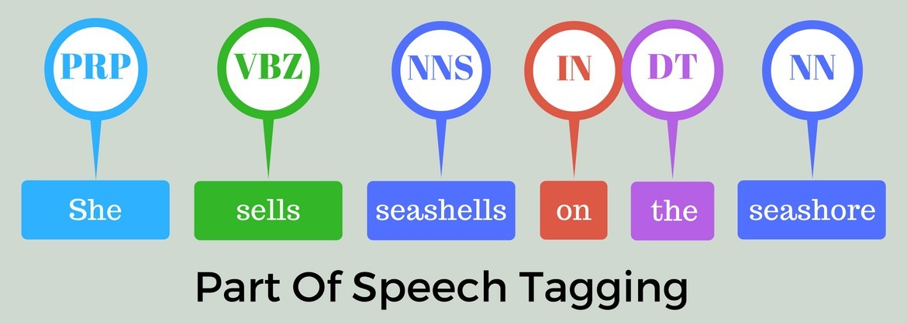

# Part of Speech (POS) tagging
Part Of Speech Tagging is a very well known task in the NLP community, and a lot of different approaches have been studied in order to tackle it. For this assignment we used the following [dataset](https://raw.githubusercontent.com/nltk/nltk_data/gh-pages/packages/corpora/dependency_treebank.zip).

<figure>
    
    

        <em>Image from</em> 
        <a href="https://www.kaggle.com/code/hrmello/part-of-speech-tagging">Kaggle</a>
    

</figure>

## Implementation
The task was to implement four different neural network architectures, very similar in structure.
The ***baseline model*** is built as follows:
- **Input Layer**, which is a vector of (nonnegative) integers of size MAX_SEQUENCE, a constant that has been defined equal to 96 and that has been also used in the EncodeLabels and TokenizeFeatures classes (look at the code);
- immediately follows a non-trainable **Embedding layer**, initialized with an embedding matrix built on top of the publicly available [GloVe embeddings](https://huggingface.co/stanfordnlp/glove/tree/main) of dimension 300, with 6 billion tokens, with some additional vectors that have been randomly generated for OOV words;
- **Bidirectional LSTM layer**;
- fully connected **Dense Layer** with a number of units equal to the number of all the possible Part Of Speech tags (we wanted the network to output a probability distribution, reason for which we used the softmax activation function).

<figure>
    
    

        <em>Image of our baseline model</em>
    

</figure>

The other *three models* have been defined starting from the baseline: instead of the Bidirectional LSTM Layer, the next two models feature, respectively, a **Bidirectional GRU Layer** and **two Bidirectional LSTM Layers**. The last one, instead, features **two Dense Layers** instead of a single one (of which the second from the top is a Time-Distributed Dense Layer).
Furthermore, around the layer that has replaced the Bidirectional LSTM Layer (or the layer itself in the fourth model), we decided to add a **Dropout** and a **SpatialDropout1D Layer** to improve the models.

## Results
In the following table you can check the results that we got on the **test set**, the F1 score is computed on the ***single tag*** and not on the entire sentence.

|Macro averages    | Precision | Recall | F1 score |
|------------------|-----------|--------|----------|
| ***Baseline***   | 0.819     | 0.807  | 0.806    |
| ***BiGRU***      | 0.840     | 0.853  | 0.844    |
| ***Dual BiLSTM***| 0.867     | 0.846  | 0.841    |
| ***Dual Dense*** | 0.849     | 0.837  | 0.835    |

As you can see the model that performed better is the ***BiGRU***.
You can find a more detailed explanation of the results in the notebook and in the report.
