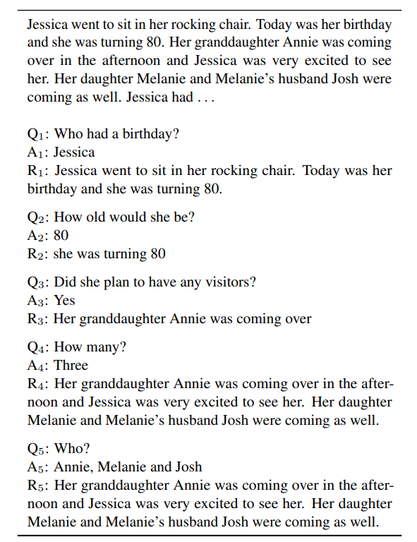
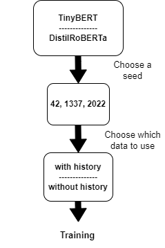

# Question Answering on CoQA
In this assignment we had to generate an answer given a question and the relative context. This is a more difficult challenge with respect to the span extraction of the answer. 
For this task we used the [CoQA dataset](https://stanfordnlp.github.io/coqa/) removing from the original dataset all the ***unanswerable*** questions as stated in the problem statement that the professors gave us.

<figure>
    
    

        <em>Image from the </em> 
        <a href="https://arxiv.org/abs/1808.07042">CoQA paper</a>
    

</figure>

CoQA contains also a rationale text, that is an optional evidence that you can use for improving the answer capabilities. In order to simplify the entire process we didn't use it and we only used the "*span text*" attribute.

***NOTE***: *in this notebook we refer to a Google Drive shared folder that we created to make the professors test the models. Even if the folder is not available anymore we left the cells that manage file saving and loading such that if you want to set your personal Drive folder the notebook is ready to use.* 

## Implementation
The task was to implement some transformer architectures, using [TinyBERT](https://arxiv.org/abs/1909.10351) and [DistilRoBERTa](https://arxiv.org/abs/1907.11692) both for the encoder and decoder part. 
***NOTE***: *this was not the best solution because BERT-like models are not the SOTA for text generation but we had to meet the requirements.*

Moreover we had to train the model with different seeds to make a final comparison of the different results obtained.

To implement the model we used the [*TFEncoderDecoderModel*](https://huggingface.co/docs/transformers/v4.24.0/en/model_doc/encoder-decoder#transformers.TFEncoderDecoderModel) class of Huggingface transformers. We imported the pretrained version for TinyBERT and DistilRoBERTa and then we performed the fine-tuning on the CoQA dataset.

We also had to consider the models fine-tuned with the **history**. Given a question i, the history includes all the previous questions and answers up to i. We concatenated all these strings to the question + the context of the current sample and we fine-tuned the models with this new dataset.

<figure>
    
    

        <em>A simple schema to create all the combination of models that we tested. </em> 
    

</figure>

## Results
In the following table you can check the results that we got on the **test set**, considering the [SQuAD](https://nlp.stanford.edu/pubs/rajpurkar2016squad.pdf) F1 score of the six best models (with different seeds, with/without history).

| Model                           | SQuAD F1 score |
|---------------------------------|:--------------:|
|***distil-roberta_1337_no_hist***|      12.59     |     
|***distil-roberta_2022_no_hist***|      12.59     |   
|***bert-tiny_2022_no_hist***     |      12.52     |    
|***bert-tiny_42_no_hist***       |      12.47     |    
|***bert-tiny_42_hist***          |      12.38     |    
|***bert-tiny_2022_hist***        |      12.37     |  

The results are not very good but we were allowed to train only for 3 epochs and the fine-tuning process was quite expensive for the HW that we had.

You can find a more detailed explanation of the results in the notebook and in the report.
